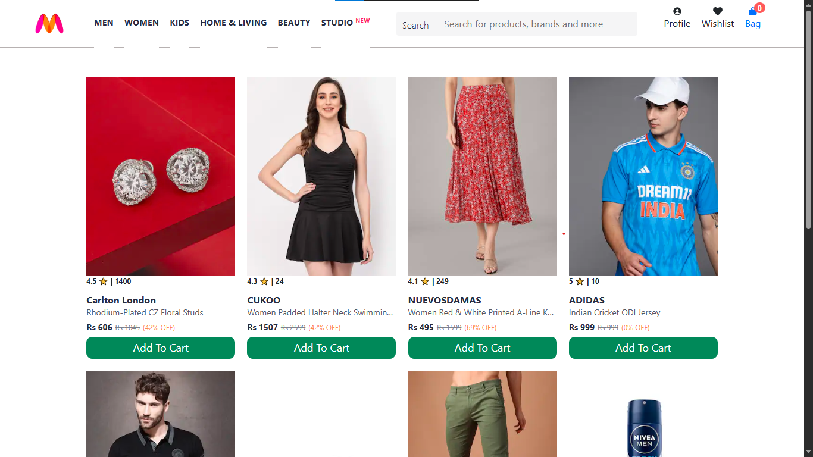
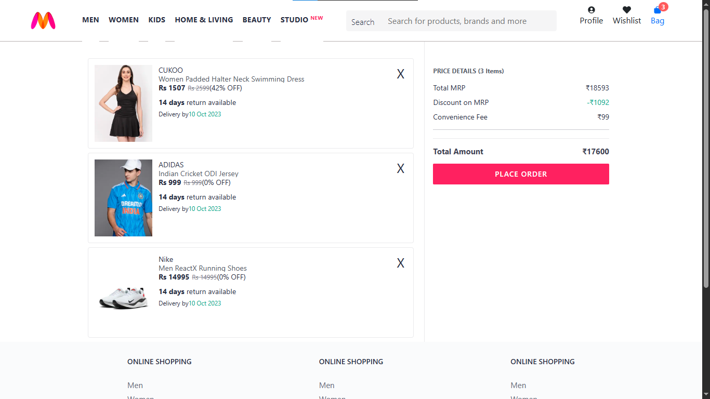

# 🛍️ Myntra Clone – Fullstack E-commerce Cart System

This project is a fullstack Myntra-style e-commerce web application built using **React** (frontend) and **Express.js** (backend). 

---

## 📸 Preview

---

## ✨ Features

- 🔎 Browse fashion products fetched from backend
- 🛒 Add items to cart with quantity tracking
- 💰 Price breakdown:
  - Total MRP
  - Discount on MRP
  - Convenience Fee
  - Final total
  -     
---

## 🔧 Tech Stack

- **Frontend**: React JS, CSS
- **Backend**: Express JS (Node.js)
- **API Integration**: Custom Express server

---

### 1. Clone the Repository

This repo is intended solely for portfolio and educational purposes.

git clone https://github.com/askdanish144/Myntra-clone-react-express.git

---

## ✨ Author

Crafted with attention to detail by **Danish Ali – Full Stack Developer & Graphic Designer**

GitHub: https://github.com/askdanish144

## 📬 Want a website like this?

I'm available to build responsive, business-focused websites tailored to any industry, whether you're a startup, local business, or growing brand.
➤ Email me at `askdanish144@gmail.com` to start a conversation.
